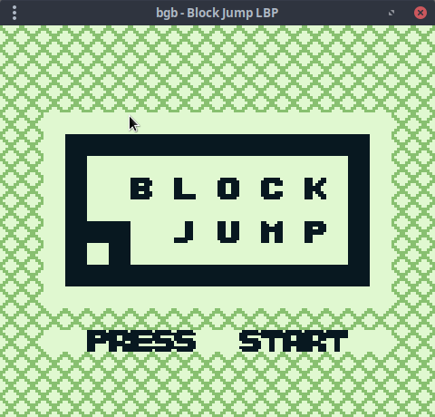
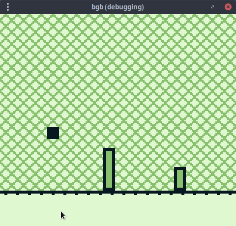

# TEGA: TypeScript Embedded GameBoy Macro Assembler

`TEGA` is a TypeScript library (also usable in JS) for programming and creating GameBoy ROM images that can be played in an emulator or on real hardware via a flashcart.

It exposes a *type safe* API for all SM83 assembly instructions, defining inline bytes (in the form of TypedArrays), moving around in ROM space, and symbols, as well as definitions of the memory map layout, hardware registers and their important bitfield postitions (based on `hardware.inc`). It also provides facilities for creating *type safe* abstractions (macros) using all the regular language features of TS. This means that you can easily generate code using all of your favourite libraries like `lodash` and `ramda`.

## A Game Example: Block Jump

A full game example can be found in [`./src/block-jump`](./src/block-jump). This game is based on the *dinosaur jumping offline* game in google chrome, and features, amongst other things:

- multiple modules
- use of the "standard library"
- random number generator strategies
- tile map compression
- physics and collision
- virtual address offsetting

There is a [video that goes into some depth](https://youtu.be/TIlx5nBnx-o) about `TEGA` and Block Jump on the Low Byte Productions YouTube channel.

## The Juicy Details

`TEGA` generates the function definitions for all of the assembly operations automatically based on the [dmgops.json](https://github.com/izik1/gbops/blob/master/dmgops.json) file in [izik1's gbops repo](https://github.com/izik1/gbops). This file is used to generate the excellent [gbops website](https://izik1.github.io/gbops/), which provides a highly detailed opcode table for the GameBoy, with tons of useful information like cycles take per op, memory operation breakdown per cycle, etc. In `TEGA`, the only name of the operation and its opcode are needed to generate overloaded, type safe function definitions for each assembly instruction. For example, 40 overloads are generated for the `LD` instruction. If you're curious about the exact transformation from JSON to TypeScript, check out the [`scripts/ops-generator.ts`](scripts/ops-generator.ts) file this repo.

The SM83 CPU (which is a *kind of* a mix between a z80 and an 8080, but with some extra custom stuff thrown in the mix) has 256 opcodes, of which 11 are considered are undefined and will lock up the CPU. One of the opcodes - `0xCB` - is a "prefix", which opens up another 256 opcodes - which mostly provide single bit operations for the 8 bit registers, as well as some extended rotations, shifts, and swaps.

Each operation returns a description of the operation, along with any dynamic (immediate) arguments it takes. At assembly time, the assembler maintains a buffer with an offset (starting at `0x150`, the entry point located just after the cartridge header), and iterates through the operations, filling in opcodes and immediate values as it goes.

Of course, there are also symbolic values like labels, references, and size calculations. A label can be created with the `label` function, which returns a description of the label. When the assembler encounters a label definition, if it hasn't already been defined, it associates the label name with the current offset. When the assembler encounters an instruction that includes a symbol reference, it makes a note to revisit it after the operations have been processed - including the offset and symbol reference object - and moves the offset forward by the size required by the instruction.

The operations `moveTo` and `inlineBytes` move the assemblers internal offset and insert bytes directly into the ROM, respectively.

When all operations have been processed, the assembler revisits the symbol references found during iteration, and attempts to resolve them. If it is unable to resolve a symbol, it means it was never defined at all, and will throw an error. Otherwise, the correct 8 or 16 bit value is inserted into the ROM buffer.

Finally the header data is inserted and the checksum computed. Though configurable header information can be passed to `TEGA`, most of the fields relate to manufacturer codes and cartridge type. Cartridge type is currently limited to "32kb ROM Only", though this is a fairly straightforward restriction to remove. The header includes 2 separate checksum calculations: one on the header - which is checked for validity and will not boot on real hardware if incorrect - and one global checksum across all bytes, which is not checked at any point.

As a point of interest, Nintendo's original method for limiting unauthorised 3rd party developers was to force all games to include a copy of the Nintendo logo in the header of the ROM, which is checked against the console's built-in bootrom for validity. If the logo doesn't match, the GameBoy will lock up in the bootrom and the game will never launch. If an unauthorised developer includes the logo, they can be sued for trademark infringement! Though the GameBoy is more than 3 decades old at this point, there is still hesitancy in the emudev and homebrew communities towards including such legally murky byte sequences - though in an assembler it's an absolute requirement. And I have to admit I have continued this cycle of paranoia by not including the bytes directly in my own code, but rather a sequence of bytes that can be xor'd with another known value to produce the original sequence. I honestly think it's pure superstition at this point, but also kind of funny if nothing else.

## Current support

- 32kb ROMs only
- All (documented) assembly instructions
- Symbolic values
  - Labels and references to labels in instructions
  - Size calculations determined at assembly time
  - Current address / current instruction address
- Interface for defining `block`s - a group of instructions and/or data that generates and inserts symbols for the start/end and calculates and exposes the size. Can be used for macros, subroutines, interrupt handlers, etc
- Generates a header with valid checksums

## Future plans

- Higher level macro abstractions
- Larger ROM sizes / MBC possibilities
- Facilities for automatically converting and loading images to tile data / tile maps
